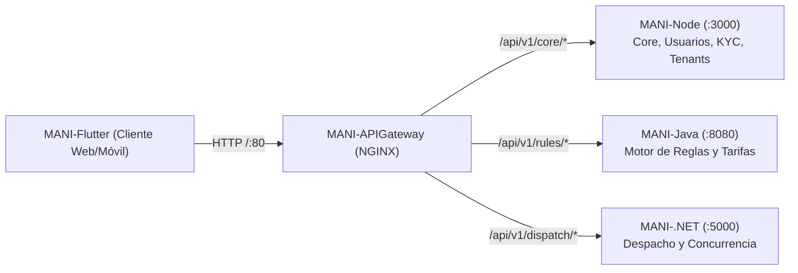

# MANI-APIGateway — API Gateway del Ecosistema MANI

API Gateway central basado en **NGINX** para la plataforma **MANI** (*TRAMA · Ingeniería de Software*).

Este repositorio actúa como el **único punto de entrada perimetral (puerto 80)** para todas las aplicaciones cliente (`MANI-Flutter` en Web y Móvil), enrutando, securizando y balanceando el tráfico hacia los microservicios backend políglotas.

---

## 🏛️ Rol en la Arquitectura SOA (ADR-0019)

Dentro de la arquitectura orientada a servicios (SOA) de MANI, el Gateway cumple las siguientes responsabilidades transversales:

1. **Punto Único de Entrada:** Oculta la topología y puertos internos de la red de microservicios, exponiendo una API unificada bajo el puerto estándar `80`.
2. **Enrutamiento Reverso:** Despacha peticiones HTTP basándose en el prefijo de la URI hacia el microservicio correspondiente.
3. **Observabilidad Distribuida:** Genera o propaga el encabezado `X-Correlation-ID` en cada solicitud para permitir trazabilidad distribuida extremo a extremo en logs.
4. **Soporte de CORS:** Gestiona políticas de Cross-Origin Resource Sharing (`Access-Control-Allow-*`) para clientes web SPA.
5. **Logs Estructurados en JSON:** Registro de métricas de acceso y latencia (`request_time`, `status`, `x_correlation_id`).



---

## 🗺️ Matriz de Enrutamiento

| Prefijo de Ruta Externa | Microservicio Destino | Puerto Interno | Dominio / Responsabilidad |
| :--- | :--- | :---: | :--- |
| **`/health`** | Gateway Local | `80` | Healthcheck del propio API Gateway. |
| **`/api/v1/core/*`** | **`MANI-Node`** | `3000` | Gestión de usuarios, perfiles, KYC, catálogos e historial. |
| **`/api/v1/rules/*`** | **`MANI-Java`** | `8080` | Motor de reglas de negocio, cálculo de tarifas y ranking de aliados. |
| **`/api/v1/dispatch/*`** | **`MANI-.NET`** | `5000` | Algoritmo de cercanía geográfica y exclusión concurrente de asignación. |

---

## 🛠️ Stack Tecnológico

* **Servidor Web / Proxy Reverso:** NGINX Alpine Linux.
* **Contenerización:** Docker & Docker Compose.
* **Red:** Bridge `mani-network`.

---

## 🚀 Ejecución y Despliegue Local

### Prerrequisitos
* Docker y Docker Compose instalados.

### 1. Validar la configuración de NGINX
```bash
docker run --rm -v ${PWD}/nginx.conf:/etc/nginx/nginx.conf nginx:alpine nginx -t
```

### 2. Construir la imagen Docker local
```bash
docker build -t mani-api-gateway:local .
```

### 3. Levantar el Gateway de forma aislada
```bash
docker run -d -p 80:80 --name mani-gateway mani-api-gateway:local
```

### 4. Orquestación Completa con Microservicios
Para levantar el Gateway junto con los microservicios en la red compartida:
```bash
docker-compose up -d --build
```

---

### 5. Base de datos local (perfil `db`)
```bash
cp .env.example .env                    # opcional: puertos y credenciales locales
docker compose --profile db up -d       # PostgreSQL 16 (:5432) + Adminer (http://localhost:8088)
./scripts/migrate-local.sh              # aplica las migraciones pendientes (Windows: .\scripts\migrate-local.ps1)
```
El cliente web se suma con el perfil `web`, después de construir `mani-web:local` en `MANI-Flutter`. Guía completa: [`database/README.md`](database/README.md).

---

## 🗄️ Infraestructura Compartida (CFG-33)

Este repositorio es el dueño de la infraestructura compartida que antes vivía en `MANI-Flutter`. El repositorio `MANI-Infra` previsto en ADR-0004 no existe, y el equipo eligió este repo como destino.

| Ruta | Contenido |
| :--- | :--- |
| `database/init/` | Scripts que el contenedor `postgres` ejecuta al crearse (esquema, seeds y funciones) |
| `database/migrations/` | Migraciones versionadas `NNN_descripcion.sql`, idempotentes e inmutables una vez fusionadas ([convención](database/migrations/README.md)) |
| `database/verify/` | Verificaciones SQL (aislamiento multi-tenant, categorías del aliado, dominios) |
| `scripts/` | `migrate-local` y `sync-db-from-qa` (`.sh` y `.ps1`) para la base local |
| `supabase/` | PoC de CFG-09/10/12/13 y seeds de QA ([guía](supabase/seed/README.md)) |

El `nginx.conf` de `MANI-Flutter` **no** se movió: sirve la SPA dentro de la imagen web del cliente y no es configuración del Gateway.

### Quién ejecuta las migraciones en cada ambiente

| Ambiente | Responsable | Cómo |
| :--- | :--- | :--- |
| DEV local | Cada desarrollador | `scripts/migrate-local.*` contra `mani-postgres` |
| DEV / TEST-QA (Supabase) | DevOps | Aplica `database/migrations/` en orden, después de fusionar el PR. Automatizarlo en el pipeline de este repo queda en CFG-29 |
| PROD | DevOps, con aprobación del PR de release | Solo migraciones ya validadas en QA (schema-first, `INFRAESTRUCTURA_MANI.md` §15). Nunca cambios manuales al esquema |

> Pendiente de registrar en `MANI-docs` (`INFRAESTRUCTURA_MANI.md` §15 y enmienda de ADR-0004) dentro de la misma tarea CFG-33.

---

## 🔍 Verificación de Salud (Healthcheck)

```bash
curl -i http://localhost/health
```

**Respuesta esperada:**
```json
{
  "status": "UP",
  "gateway": "MANI-APIGateway",
  "timestamp": "2026-10-05T19:50:00Z"
}
```

---

## 📄 Protocolos y Encabezados Clave

* **`Authorization`:** Se propaga intacto el token `Bearer <JWT>` hacia los microservicios backend para validación de claims y tenant.
* **`X-Correlation-ID`:** Identificador único UUID por petición; si el cliente no lo envía, NGINX lo genera automáticamente.

---

## 👥 Equipo y Gobernanza
* **Organización:** [TRAMA · Ingeniería de Software](https://github.com/Trama-AS)
* **Repositorio Oficial:** [MANI-APIGateway](https://github.com/Trama-AS/MANI-APIGateway)
